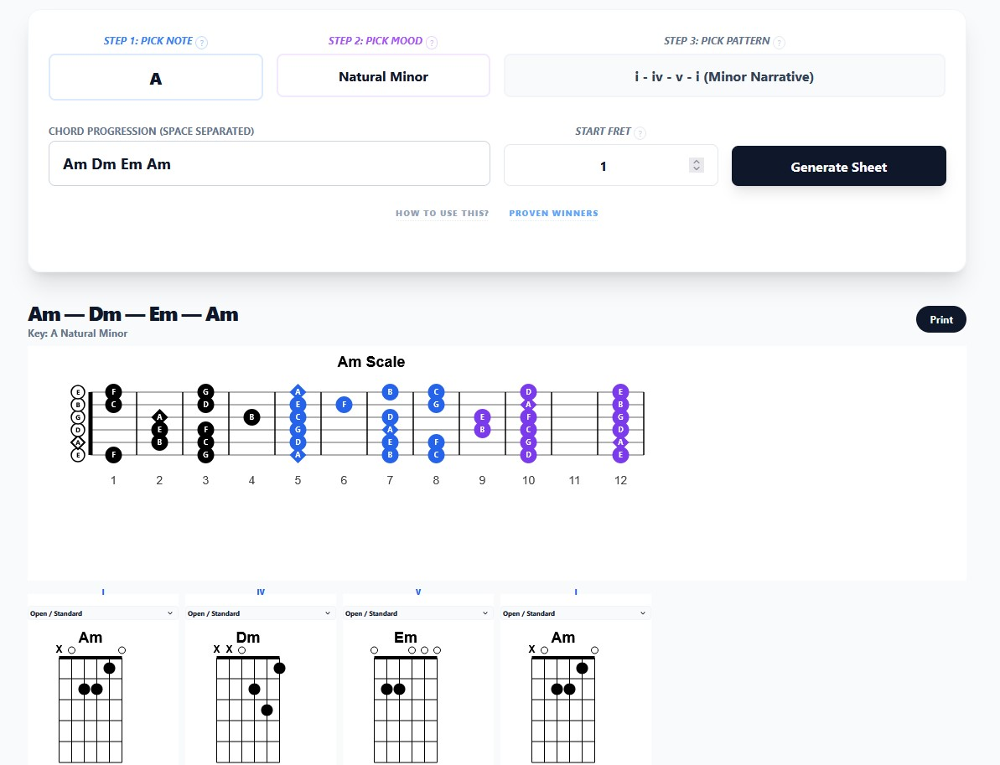
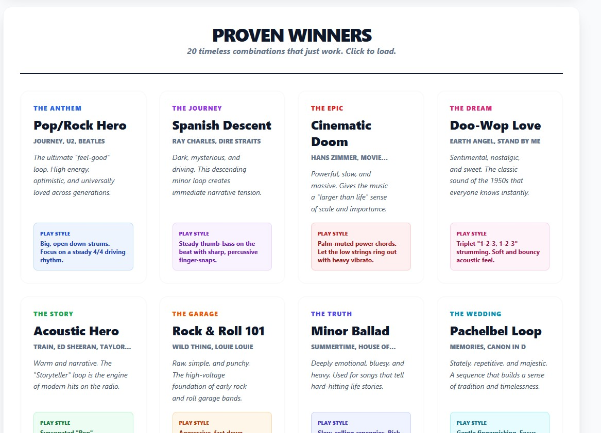
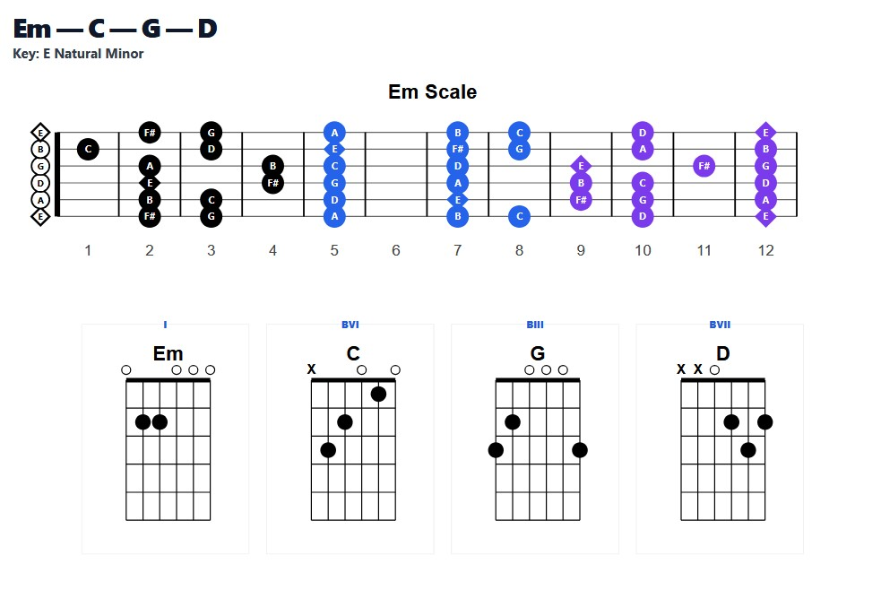

# Fretboard Compass: Music Theory Suite for Guitarists

[](https://github.com/rubysash/fretboard-compass/blob/main/demo.jpg)
[](https://github.com/rubysash/fretboard-compass/blob/main/demo2.jpg)
[](https://github.com/rubysash/fretboard-compass/blob/main/demo3.jpg)

**Fretboard Compass** aims to be a professional-grade Music Theory Suite for guitarists. It transforms complex intervals, exotic scales, and chord progressions into printable, "Binder-Ready" practice materials.

Designed for students and teachers, it takes the guesswork out of the fretboard by mathematically calculating every note and fingering.


---

## Key Features

### Pro Theory Engine
- **Analytical Triad Building:** Dynamically constructs Major, Minor, Diminished, Augmented, and Suspended chords from any 7-note scale.
- **Harmonic Borrowing:** Smart logic for presets (like Flamenco and Jazz) that prioritizes musicality over robotic diatonicism.
- **Dynamic Roman Numerals:** Context-aware Nashville numbering that handles accidentals (bII, #IV) and proper casing (I vs i).

### Visual Fretboard Mastery
- **Positional Zoning:** The neck is divided into three high-contrast color zones (Zone 1: Black, Zone 2: Blue, Zone 3: Purple) to help students master one "neighborhood" at a time.
- **Diamond Roots:** Instant geometric identification of the scale root across the entire 12-fret map.
- **CAGED System:** Automatically finds standard movable shapes for any chord, anywhere on the neck.

### Interactive Discovery
- **Proven Winners:** A dashboard of 20 timeless chord/scale combinations (e.g. "The Anthem," "Cinematic Doom," "12-Bar Shuffle") with play-style tips.
- **Favorites System:** Save your custom "vibes" with Titles and Descriptions (e.g. "bridge pickup settings"). Persistent JSON storage for easy recall.
- **Solver Sync:** Entering a manual progression now automatically updates the Note and Mood dropdowns to match the detected theory.
- **One Neighborhood Guide:** A built-in, printable practice manual for mastering the neck in 30 minutes a day.

---

## Example Printouts

Explore these "Binder-Ready" PDF examples generated directly from the suite:

- [📄 Am Blues: Shadows and Dust](https://github.com/rubysash/fretboard-compass/blob/main/Am-Blues-Shadows-And-Dust.pdf)
- [📄 Am Spanish Harmonic](https://github.com/rubysash/fretboard-compass/blob/main/Am-Spanish-Harmonic.pdf)
- [📄 C Major: Standard Practice](https://github.com/rubysash/fretboard-compass/blob/main/C-major-Standard.pdf)

---

## Architecture & Theory Logic

To balance musicality with mathematics, the suite follows a three-tier logic system:

### 1. Hard-Coded Data (The "Fixed" Knowledge)
These are the foundational "atoms" of the system:
- **Scale Intervals:** Semitone patterns for 15+ scales (Major, Minor, Dorian, etc.).
- **Chord Patterns:** Semitone offsets for basic chord types (Major, Minor, 7, Maj7, m7, dim, aug, m7b5).
- **Guitar Voicing Templates:** A database of ~30 `STANDARD_VOICINGS` (Open chords) and `MOVABLE_VOICINGS` (CAGED barre shapes) ensures that suggested fingerings are physically playable and musically common.

### 2. Heuristics (The "Best Guess" Logic)
The "suggestions" use weighted scoring to feel more like a human teacher:
- **Key Detection:** Favors the first chord entered (**+15% Tonic Bias**) and standard Major/Minor scales (**+5% Commonality Bonus**).
- **Fingering Selection:** Prioritizes "Standard" open chords at Fret 1 and "Movable" barre shapes for higher positions, falling back to a "Positional Solver" greedy algorithm as a last resort.

### 3. Truly Dynamic (Mathematical) Logic
These are calculated from scratch every time:
- **Nashville Numbering:** Dynamically compares chord roots to scale benchmarks to handle complex accidentals (#IV, bVII) and proper casing.
- **Triad Building:** "Walks" any 7-note scale to build chords mathematically (1-3-5) based on internal intervals.
- **Scale Mapping:** Checks every fret on the guitar against the calculated scale notes to generate the 12-fret master map.

---

## Tech Stack

- **Backend:** Python 3.12+ / Flask
- **Frontend:** HTMX (Interactivity), Tailwind CSS (Aesthetics)
- **Graphics:** svgwrite (Vector Diagram Generation)
- **Print:** Optimized CSS @media print for 8.5x11 Portrait symmetry.

---

## Quick Start

### 1. Prerequisites (Python 3.12+)
This project requires Python 3.12 or higher.

- **Windows:** [Download Python 3.12.x](https://www.python.org/ftp/python/3.12.9/python-3.12.9-amd64.exe) (Official 64-bit Installer)
- **macOS:** [Download Python 3.12.x](https://www.python.org/ftp/python/3.12.9/python-3.12.9-macos11.pkg) (Official Universal Installer) or use `brew install python@3.12`.
- **Linux:** Install via your package manager (e.g., `sudo apt install python3.12`).

### 2. Clone & Setup

**Windows:**
```bash
git clone https://github.com/rubysash/fretboard-compass.git
python -m venv fretboard-compass
cd fretboard-compass
Scripts\activate
python -m pip install pip --upgrade pip
python -m pip install -r requirements.txt
```

**Linux / macOS:**
```bash
git clone https://github.com/rubysash/fretboard-compass.git
python3 -m venv fretboard-compass
cd fretboard-compass
source bin/activate
python3 -m pip install pip --upgrade pip
python3 -m pip install -r requirements.txt
```

### 3. Run the Suite
```bash
# Windows
python run.py

# Linux / macOS
python3 run.py
```
Visit http://127.0.0.1:5000 in your browser.

### 3. Generate & Print
1. Click "Proven Winners" to load a classic combination.
2. Hit "Generate Sheet".
3. Use the Fingering Selector on any chord card to match your preferred "Neighborhood".
4. Press "Print" to generate a perfect 8.5x11 practice sheet for your binder.

---

## Roadmap
- [x] Full CAGED movable voicing support.
- [x] Mathematical triad building for exotic scales.
- [x] "Proven Winners" interactive dashboard.
- [x] Favorites system with Titles and Descriptions.
- [ ] TypeScript port for Cloudflare Workers deployment.
- [ ] Stripe integration for "Pro" tier features.

---

## Version Log

### v0.1.6
- **Print Optimization:** Adjusted chord card sizing to fit 5 cards per row on 8.5x11 portrait paper for denser, more efficient practice sheets.
- **Cross-Platform Support:** Added official setup instructions for Linux and macOS, including direct Python 3.12 download links and `brew` support.

### v0.1.5
- **Scale Nomenclature:** Clarified "Blues" scale as "Minor Blues" and added a dedicated "Major Blues" variant (1-2-b3-3-5-6) for better user intuition.
- **UI Sync:** Integrated HTMX `HX-Trigger` to synchronize main dashboard dropdowns with auto-detected theory results in real-time.

### v0.1.4
- **Theory Architecture:** Documented the 3-tier theory engine (Fixed Knowledge, Heuristics, Dynamic Logic) in the README for transparency.
- **Manual Solver:** Added the `force_theory` flag to allow users to override auto-detection via the "Scale Lens" selector.

### v0.1.2
- **Fixed Favorites Saving:** Wrapped the Save Favorite form in a proper form element to ensure custom titles and descriptions are correctly captured and persisted.
- **Improved Visuals:** Enhanced the readability of Favorite cards by adjusting font sizing and leading.

### v0.1.1
- **Solver Sync:** Entering a manual progression now automatically updates the "Note" and "Mood" dropdowns to match the detected theory.
- **Interactive UI:** The Star button now opens an inline form for better context when saving favorites.

### v0.1.0
- Initial professional release of **Fretboard Compass**.
- Implemented **Proven Winners** and **Favorites** systems.
- Added **Positional Zoning** and **Diamond Roots** to SVG engine.
- Established **Binder-Ready** 8.5x11 printing layout.

---

*Created for guitarists who want to spend less time thinking about dots and more time making music.* 🤘
